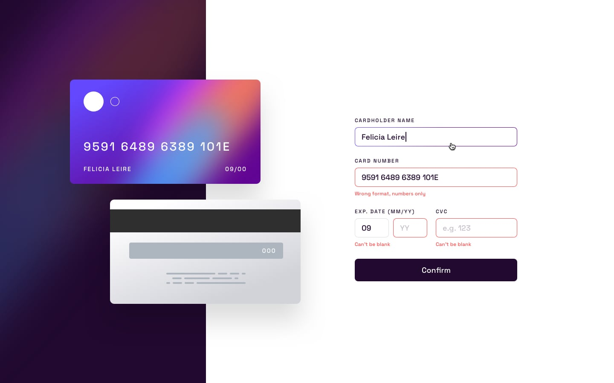

# Card Details Project
## Technologies Used
- FrontEnd : ReactJS
- Frontend Deployment : Netlify app

## How To run
- clone the repository
- go to project folder in terminal
- npm install
- npm start

## Look
### Desktop-design
Layout:1147px

### Mobile-design
Layout:500px

### Active states
- cardholder name can't be blank
- card number should be in correct format.
- date can't be blank
- cvv should not be less or more than 3 digits.
- cvv can't be blank

